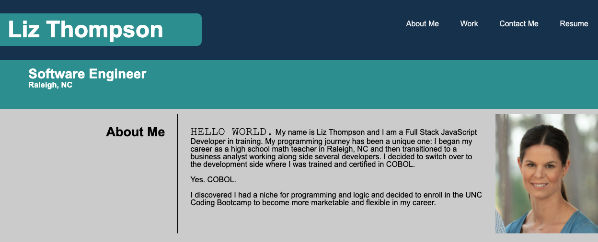
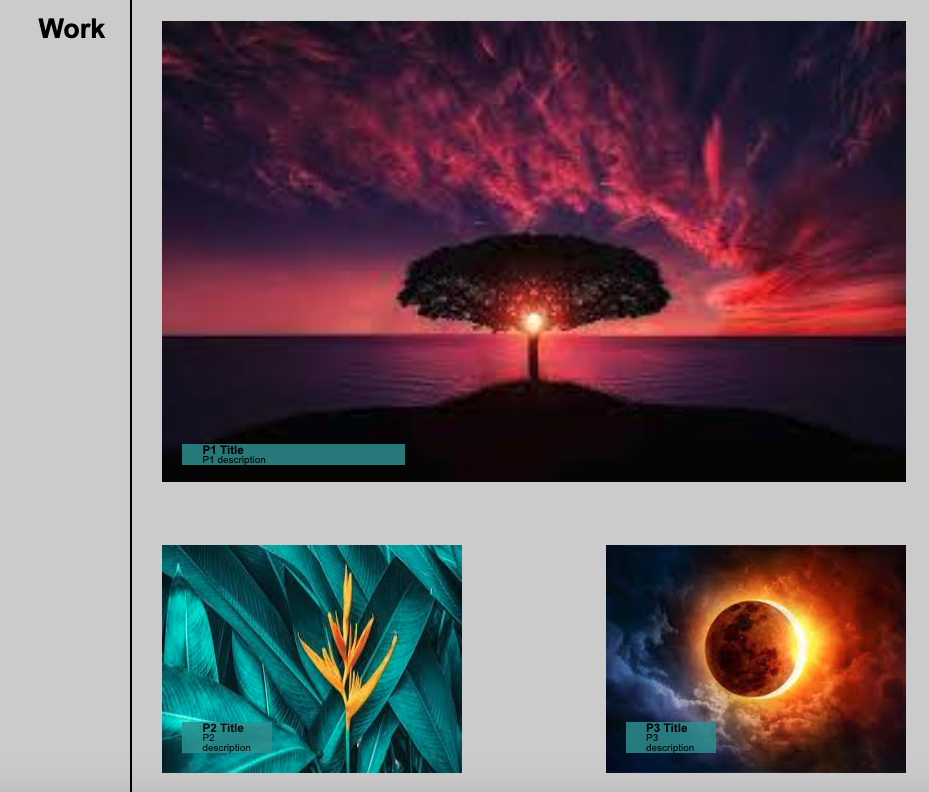

# Professional-Portfolio

The purpose of this webpage is to create a professional portfolio to display work, contact information, and information about myself. 

## Navigation Bar

The navigation bar is located in the top, right portion of the webpage. When you select the "About Me", "Work", or "Contact Me" tabs, you will be directed to the corresponding content on the webpage.  When you select the "Resume" tab, you will be directed to a Google doc that contains a pdf of my resume. This will open in a new tab. 

## About Me

The "About Me" portion of this webpage contains a photo, work-related information, job title, name and location.  This portion of the webpage can be accessed by clicking on the "about me" tab on the navigation bar in the top, right portion of the webpage. 

## Work

The "Work" portion of this webpage contains the main content of the portfolio. Since this is my first real project, you will see placeholder images and descriptions. Once we have completed more projcts, those projects will be linked appropriately by incorporating images of the webpage and links. The "work" portion of this webpage can be easily accessed by selecting the "Work" tab on the navigation bar in the top, right portion of the webpage. 

## Contact Me

The "Contact Me" portion of this webpage contains links to my LinkedIn and GitHub as well as my email and phone number.  This portion of the webpage can be accessed by clicking on the "Contact Me" tab on the navigation bar in the top, right portion of the webpage. 

